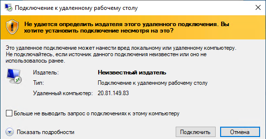
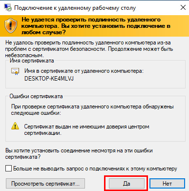
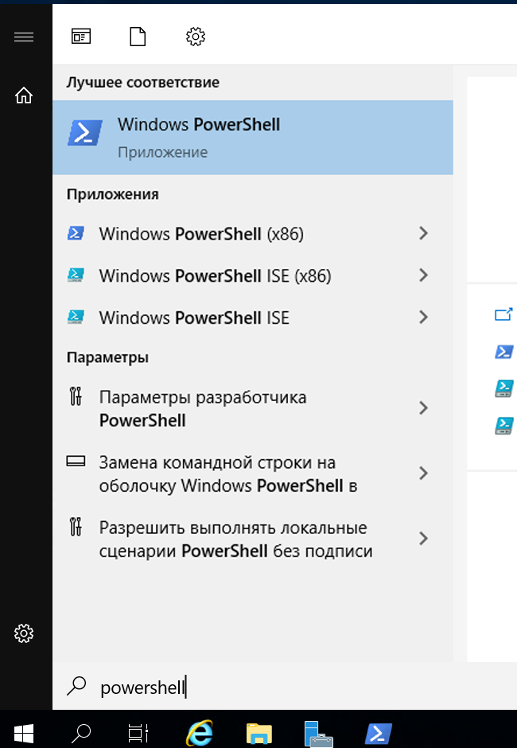

---
wts:
  title: "01\_— Создание виртуальной машины на портале (10 мин)"
  module: Module 02 - Core Azure Services (Workloads)
---
# <a name="01---create-a-virtual-machine-in-the-portal-10-min"></a>01 — Создание виртуальной машины на портале (10 мин)

В этом пошаговом руководстве мы создадим виртуальную машину на портале Azure, подключимся к ней, установим роль веб-сервера и проведем тестирование. 

**Примечание**. Во время работы с этим пошаговым руководством уделите время на ознакомление со сведениями, отображаемыми при щелчке информационных значков. 

# <a name="task-1-create-the-virtual-machine"></a>Задача 1. Создание виртуальной машины 
1. Войдите на портал Azure: **https://portal.azure.com**

3. В колонке **Все службы** в меню «Портал», найдите и выберите элемент **Виртуальные машины**, а затем щелкните **+Создать** и выберите **+Виртуальная машина Azure** в раскрывающемся списке.

4. На вкладке **Основные** укажите следующие сведения (для остальных параметров оставьте значения по умолчанию):

    | Параметры | Значения |
    |  -- | -- |
    | Подписка | **Использовать предоставленное по умолчанию** |
    | Группа ресурсов | **Создание группы ресурсов** |
    | Имя виртуальной машины | **myVM** |
    | Регион | **Восточная часть США (США)**|
    | Параметры доступности | Избыточность параметров инфраструктуры не требуется|
    | Image | **Windows Server 2019 Datacenter, пок. 2**|
    | Размер | **Standard D2s v3**|
    | Имя пользователя учетной записи администратора | **azureuser** |
    | Пароль учетной записи администратора (внимательно следите за правильностью ввода!) | **Pa$$w0rd1234**|
    | Правила входящего порта - | **Разрешить выбранные порты **|
    | Выбрать входящие порты | **RDP (3389)** и **HTTP (80)**| 

5. Перейдите на вкладку «Сеть», чтобы убедиться, что выбраны порты **HTTP (80) и RDP (3389)** в разделе **Выбрать входящие порты**.

6. Перейдите на вкладку "Управление" и в разделе **Мониторинг** выберите следующий параметр:

    | Параметры | Значения |
    | -- | -- |
    | Диагностика загрузки | **Отключить**|

7. Для остальных параметров оставьте значения по умолчанию и нажмите кнопку **Просмотр и создание** в нижней части страницы.

8. Once Validation is passed click the <bpt id="p1">**</bpt>Create<ept id="p1">**</ept> button. It can take anywhere from five to seven minutes to deploy the virtual machine.

9. Вы будете получать сведения о ходе выполнения на странице развертывания и в области **Уведомления** (значок колокольчика в верхней строке меню).

# <a name="task-2-connect-to-the-virtual-machine"></a>Задача 2. Подключение к виртуальной машине

В рамках этой задачи мы подключимся к новой виртуальной машине по протоколу удаленного рабочего стола RDP (Remote Desktop Protocol). 

1. Щелкните значок колокольчика на верхней синей панели инструментов и после успешного завершения развертывания выберите «Перейти к ресурсу». 

    **Примечание**. Можно также воспользоваться ссылкой **Перейти к ресурсу** на странице развертывания 

2. В колонке **Обзор** виртуальной машины нажмите кнопку **Подключить** и выберите **RDP** в раскрывающемся списке.

    

    <bpt id="p1">**</bpt>Note<ept id="p1">**</ept>: The following directions tell you how to connect to your VM from a Windows computer. On a Mac, you need an RDP client such as this Remote Desktop Client from the Mac App Store and on a Linux computer you can use an open source RDP client.

2. On the <bpt id="p1">**</bpt>Connect to virtual machine<ept id="p1">**</ept> page, keep the default options to connect with the public IP address over port 3389 and click <bpt id="p2">**</bpt>Download RDP File<ept id="p2">**</ept>. A file will download on the bottom left of your screen.

3. **Откройте** загруженный RDP-файл (находится в нижней левой области вашего лабораторного компьютера) и щелкните **Подключить** после вывода соответствующего предложения. 

    

4. В окне **Безопасность Windows** выполните вход с помощью учетных данных администратора, использованных вами при создании вашей ВМ **azureuser**, и пароля **Pa$$w0rd1234**. 

5. You may receive a warning certificate during the sign-in process. Click <bpt id="p1">**</bpt>Yes<ept id="p1">**</ept> or to create the connection and connect to your deployed VM. You should connect successfully.

    

A new Virtual Machine (myVM) will launch inside your Lab. Close the Server Manager and dashboard windows that pop up (click "x" at top right). You should see the blue background of your virtual machine. <bpt id="p1">**</bpt>Congratulations!<ept id="p1">**</ept> You have deployed and connected to a Virtual Machine running Windows Server. 

# <a name="task-3-install-the-web-server-role-and-test"></a>Задача 3. Установка роли веб-сервера и тестирование

В рамках этой задачи вы установите роль веб-сервера на сервере на только что созданной вами виртуальной машине и убедитесь, что будет отображаться стандартная страница приветствия IIS. 

1. На вновь открытой виртуальной машине запустите PowerShell, выполнив поиск **PowerShell** в строке поиска, а когда этот элемент будет найден, щелкните правой кнопкой мыши **Windows PowerShell**, чтобы выполнить **Запуск от имени администратора**.

    

2. In PowerShell, install the <bpt id="p1">**</bpt>Web-Server<ept id="p1">**</ept> feature on the virtual machine by running the following command. (Paste in the command and hit ENTER for the installment to begin).

    ```PowerShell
    Install-WindowsFeature -name Web-Server -IncludeManagementTools
    ```
  
3. When completed, a prompt will state <bpt id="p1">**</bpt>Success<ept id="p1">**</ept> with a value <bpt id="p2">**</bpt>True<ept id="p2">**</ept>. You do not need to restart the virtual machine to complete the installation. Close the RDP connection to the VM by clicking the <bpt id="p1">**</bpt>x<ept id="p1">**</ept> on the blue bar at the top center of your virtual machine. You can also minimize it by clicking the <bpt id="p1">**</bpt><ph id="ph1">-</ph><ept id="p1">**</ept> on the blue bar at the top center.

    

4. Вернитесь на портал, перейдите обратно в колонку **Обзор** виртуальной машины myVM, нажмите кнопку **Копировать в буфер обмена**, чтобы скопировать общедоступный IP-адрес виртуальной машины myVM, откройте новую вкладку в браузере, вставьте этот адрес в текстовое поле URL-адреса и нажмите клавишу **Ввод** для перехода.

    

5. Отобразится страница приветствия веб-сервера IIS.

    

<bpt id="p1">**</bpt>Congratulations!<ept id="p1">**</ept> You have created a new VM running a web server that is accessible via its public IP address. If you had a web application to host, you could deploy application files to the virtual machine and host them for public access on the deployed virtual machine.


<bpt id="p1">**</bpt>Note<ept id="p1">**</ept>: To avoid additional costs, you can optionally remove this resource group. Search for resource groups, click your resource group, and then click <bpt id="p1">**</bpt>Delete resource group<ept id="p1">**</ept>. Verify the name of the resource group and then click <bpt id="p1">**</bpt>Delete<ept id="p1">**</ept>. Monitor the <bpt id="p1">**</bpt>Notifications<ept id="p1">**</ept> to see verify that the deletion completed successfully. 
