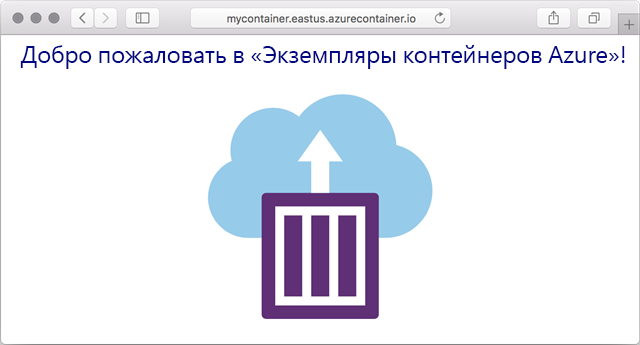

---
wts:
  title: "03\_— Развертывание экземпляров контейнеров Azure (10 мин)"
  module: Module 02 - Core Azure Services (Workloads)
---

# 03 — Развертывание экземпляров контейнеров Azure (10 мин)

In this walkthrough we create, configure, and deploy a container by using Azure Container Instances (ACI) in the Azure Portal. The container is a Welcome to ACI web application that displays a static HTML page. 

# Задача 1. Создание экземпляра контейнера 

В рамках этой задачи мы создадим экземпляр контейнера для веб-приложения.  

1. Войдите на [портал Azure](https://portal.azure.com).

2. В колонке **Все службы** найдите и выберите элемент **Экземпляры контейнеров**, а затем щелкните **+ Добавить, + Создать, + Новый**. 

3. Укажите следующие основные сведения для нового экземпляра контейнера (для остальных параметров оставьте значения по умолчанию): 

    | Параметр| Значение|
    |----|----|
    | Подписка | ***Использовать предоставленное по умолчанию*** |
    | Группа ресурсов | **Создание группы ресурсов** |
    | Имя контейнера| **mycontainer**|
    | Регион | **Восточная часть США (США)** |
    | Источник образа| **Docker Hub или другой реестр**|
    | Тип образа| **Public**|
    | Image| **mcr.microsoft.com/azuredocs/aci-helloworld**|
    | Тип ОС| **Linux** |
    | Размер| ***Оставьте значение по умолчанию***|

4. Configure the Networking tab (replace <bpt id="p1">**</bpt>xxxxx<ept id="p1">**</ept> with letters and digits such that the name is globally unique). Leave all other settings at their default values.

    | Параметр| Значение|
    |--|--|
    | Метка DNS-имени| **mycontainerdnsxxxxx** |

    
    <bpt id="p1">**</bpt>Note<ept id="p1">**</ept>: Your container will be publicly reachable at dns-name-label.region.azurecontainer.io. If you receive a <bpt id="p1">**</bpt>DNS name label not available<ept id="p1">**</ept> error message following the deployment, specify a different DNS name label (replacing the xxxxx) and re-deploy. 

5. Щелкните **Проверить и создать**, чтобы запустить процесс автоматической проверки.

6. Нажмите кнопку **Создать**, чтобы создать экземпляр контейнера. 

7. Отслеживайте ход выполнения на странице развертывания и странице **Уведомления**. 

# Задача 2. Проверка развертывания экземпляра контейнера

В рамках этой задачи мы подтвердим, что экземпляр контейнера выполняется, проверив отображение страницы приветствия.

1. После завершения развертывания щелкните ссылку **Перейти к ресурсу** на странице развертывания или ссылку на ресурс в области "Уведомления".

2. В колонке **Обзор** контейнера **mycontainer** убедитесь, что **Состояние** контейнера имеет значение **Выполняется**. 

3. Найдите полное доменное имя (FQDN).

    

2. В этом пошаговом руководстве мы создадим, настроим и развернем контейнер, используя службу «Экземпляры контейнеров Azure» (ACI) на портале Azure. 

    

Этот контейнер представляет собой веб-приложение, отображающее статическую HTML-страницу с приветствием экземпляров контейнеров Azure.

<bpt id="p1">**</bpt>Note<ept id="p1">**</ept>: To avoid additional costs, you can optionally remove this resource group. Search for resource groups, click your resource group, and then click <bpt id="p1">**</bpt>Delete resource group<ept id="p1">**</ept>. Verify the name of the resource group and then click <bpt id="p1">**</bpt>Delete<ept id="p1">**</ept>. Monitor the <bpt id="p1">**</bpt>Notifications<ept id="p1">**</ept> to see how the delete is proceeding.
