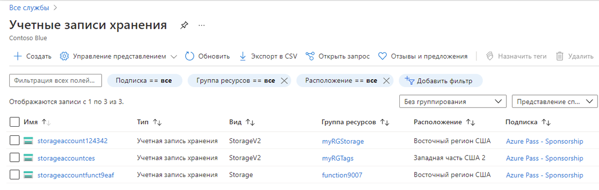
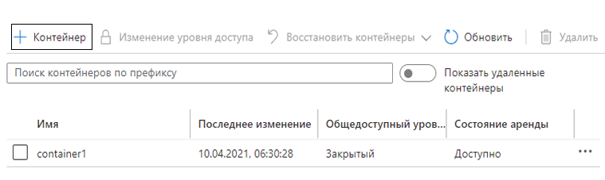

---
wts:
  title: "05\_— Создание хранилища BLOB-объектов (5 мин)"
  module: Module 02 - Core Azure Services (Workloads)
---
# 05 — Создание хранилища BLOB-объектов (5 мин)

В этом пошаговом руководстве мы создадим учетную запись хранения, а затем будем работать с файлами хранилища BLOB-объектов.

# Задача 1. Создание учетной записи хранения 

В рамках этой задачи мы создадим учетную запись хранения. 

1. Войдите на портал Azure по адресу <a href="https://portal.azure.com" target="_blank">https://portal.azure.com</a>.

2. В колонке **Все службы** найдите и выберите элемент **Учетные записи хранения**, а затем щелкните **+ Добавить, + Создать, + Новый**. 

3. On the <bpt id="p1">**</bpt>Basics<ept id="p1">**</ept> tab of the <bpt id="p2">**</bpt>Create storage account<ept id="p2">**</ept> blade, fill in the following information (replace <bpt id="p3">**</bpt>xxxx<ept id="p3">**</ept> in the name of the storage account with letters and digits such that the name is globally unique). Leave the defaults for everything else.

    | Параметр | Значение | 
    | --- | --- |
    | Подписка | **Оставьте предоставленные значения по умолчанию** |
    | Группа ресурсов | **Создание группы ресурсов** |
    | Имя учетной записи хранения | **storageaccountxxxxx** |
    | Расположение | **Восточная часть США (США)**  |
    | Производительность | **Standard Edition** |
    | Избыточность | **Локально избыточное хранилище (LRS)** |
    
    **Примечание.** Не забудьте заменить символы **xxxxx**, чтобы **Имя учетной записи хранения** стало уникальным.

5. Щелкните **Просмотр и создание**, чтобы просмотреть параметры учетной записи хранения и разрешить Azure проверить конфигурацию. 

6. Once validated, click <bpt id="p1">**</bpt>Create<ept id="p1">**</ept>. Wait for the notification that the account was successfully created. 

7. На домашней странице найдите и выберите элемент **Учетные записи хранения** и убедитесь, что ваша новая учетная запись хранения присутствует в списке.

    

# Задача 2. Работа с хранилищем BLOB-объектов

В рамках этой задачи мы создадим контейнер BLOB-объектов и отправим файл BLOB-объектов. 

1. Щелкните имя новой учетной записи хранения, перейдите к разделу **Хранилище данных** в левом меню и щелкните **Контейнеры**.

2. Click <bpt id="p1">**</bpt>+ Container<ept id="p1">**</ept> and complete the information. Use the Information icons to learn more. When done click <bpt id="p1">**</bpt>Create<ept id="p1">**</ept>.

    | Параметр | Значение |
    | --- | --- |
    | Название | **container1**  |
    | Public access level (Уровень общего доступа)| **Закрытый (отсутствие анонимного доступа)** |
  

    

4. Open a new browser window and search <bpt id="p1">**</bpt>Bing<ept id="p1">**</ept> for an image of a flower. Right click on the image and save it to your VM. 

6. Снова на портале щелкните **container1**, а затем выберите **Отправка**.

5. Browse for the image file you just saved on your local computer. Select it and then select upload.

   
6. Щелкните стрелку **Дополнительно**, оставьте значения по умолчанию, но просмотрите доступные параметры, а затем щелкните **Отправить**.

    <bpt id="p1">**</bpt>Note<ept id="p1">**</ept>: You can upload as many blobs as you like in this way. New blobs will be listed within the container.

7. После отправки файла щелкните его правой кнопкой мыши и обратите внимание на параметры, включая "Просмотреть или изменить", "Скачать", "Свойства" и "Удалить". 

8. Если у вас будет время, просмотрите параметры для файлов, таблиц и очередей.

# Задача 3. Мониторинг учетной записи хранения

1. Вернитесь в колонку учетной записи хранения и щелкните **Диагностика и решение проблем**. 

2. Explore some of the most common storage problems. Notice there are multiple troubleshooters here.

3. On the storage account blade, scroll down to the <bpt id="p1">**</bpt>Monitoring<ept id="p1">**</ept> section and click <bpt id="p2">**</bpt>Insights<ept id="p2">**</ept>. Notice there is information on Failures, Performance, Availability, and Capacity. Your information will be different.

    

На вкладке **Основные** в колонке **Создание учетной записи хранения** укажите следующие сведения (замените **xxxx** в имени учетной записи хранения буквами и цифрами, чтобы имя было глобально уникальным).

Для остальных параметров оставьте значения по умолчанию.
