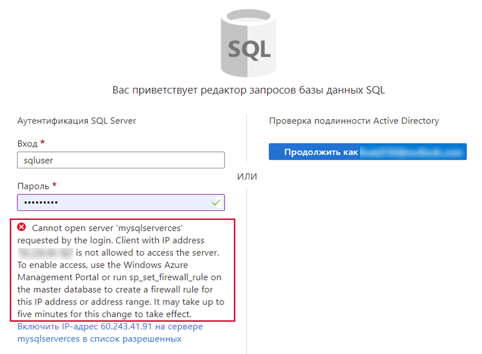

---
wts:
  title: "06\_— Создание базы данных SQL (5 мин)"
  module: Module 02 - Core Azure Services (Workloads)
---

# <a name="06---create-a-sql-database-5-min"></a>06 — Создание базы данных SQL (5 мин)

В этом пошаговом руководстве мы создадим базу данных SQL в Azure, а затем запросим данные в этой базе данных.

# <a name="task-1-create-the-database"></a>Задача 1. Создание базы данных 

В этой задаче мы создадим базу данных SQL на основе образца базы данных AdventureWorksLT. 

1. Войдите на портал Azure по адресу [ **https://portal.azure.com** ](https://portal.azure.com).

2. В колонке **Все службы** найдите и выберите элемент **Базы данных SQL**, а затем щелкните **+ Добавить, + Создать, + Новый**. 

3. На вкладке **Основы** введите следующие сведения.  

    | Параметр | Значение | 
    | --- | --- |
    | Подписка | **Использовать предоставленное по умолчанию** |
    | Группа ресурсов | **Создание группы ресурсов** |
    | Имя базы данных| **db1** | 
    | Сервер | Выберите **Создать** (справа откроется новая боковая панель)|
    | Имя сервера | **sqlserverxxxx** (должно быть уникальным) | 
    | Расположение | **Восточная часть США (США)** |
    | Метод проверки подлинности | **Использование аутентификации SQL** |
    | Имя для входа администратора сервера | **sqluser** |
    | Пароль | **Pa$$w0rd1234** |
    | Щелкните  | **OK** |

   

4. Перейдите на вкладку **Сети** и настройте следующие параметры (оставьте значения по умолчанию для других параметров). 

    | Параметр | Значение | 
    | --- | --- |
    | Метод подключения | **Общедоступная конечная точка** |    
    | Разрешить доступ к серверу службам и ресурсам Azure | **Да** |
    | Добавьте текущий IP-адрес клиента | **Нет** |
    
   

5. На вкладке **Безопасность**. 

    | Параметр | Значение | 
    | --- | --- |
    | Microsoft Defender для SQL| **Не сейчас** |
    
6. Перейдите на вкладку **Дополнительные параметры**. Мы будем использовать пример базы данных AdventureWorksLT.

    | Параметр | Значение | 
    | --- | --- |
    | Использование существующих данных | **Образец** |

    

7. Click <bpt id="p1">**</bpt>Review + create<ept id="p1">**</ept> and then click <bpt id="p2">**</bpt>Create<ept id="p2">**</ept> to deploy and provision the resource group, server, and database. It can take approx. 2 to 5 minutes to deploy.


# <a name="task-2-test-the-database"></a>Задача 2. Тестирование базы данных.

В этой задаче мы настроим SQL Server и выполним SQL-запрос. 

1. When the deployment has completed, click Go to resource from the deployment blade. Alternatively, from the <bpt id="p1">**</bpt>All Resources<ept id="p1">**</ept> blade, search and select <bpt id="p2">**</bpt>Databases<ept id="p2">**</ept>, then <bpt id="p3">**</bpt>SQL databases<ept id="p3">**</ept> ensure your new database was created. You may need to <bpt id="p1">**</bpt>Refresh<ept id="p1">**</ept> the page.

    

2. Click the <bpt id="p1">**</bpt>db1<ept id="p1">**</ept> entry representing the SQL database you created. On the db1 blade click <bpt id="p1">**</bpt>Query editor (preview)<ept id="p1">**</ept>.

3. Войдите в систему как **sqluser** с паролем **Pa$$w0rd1234**.

4. You will not be able to login. Read the error closely and make note of the IP address that needs to be allowed through the firewall. 

    

5. Снова в колонке **db1** щелкните **Обзор**. 

    

6. В колонке db1 **Обзор** щелкните элемент **Настройка брандмауэра для сервера**, расположенный в центре верхней области экрана обзора.

7. Click <bpt id="p1">**</bpt>+ Add client IP<ept id="p1">**</ept> (top menu bar) to add the IP address referenced in the error. (it may have autofilled for you - if not paste it into the IP address fields). Be sure to <bpt id="p1">**</bpt>Save<ept id="p1">**</ept> your changes. 

    

8. Return to your SQL database (slide the bottom toggle bar to the left) and click on <bpt id="p1">**</bpt>Query Editor (Preview)<ept id="p1">**</ept>. Try to login again as <bpt id="p1">**</bpt>sqluser<ept id="p1">**</ept> with the password <bpt id="p2">**</bpt>Pa$$w0rd1234<ept id="p2">**</ept>. This time you should succeed. Note that it may take a couple of minutes for the new firewall rule to be deployed. 

9. Once you log in successfully, the query pane appears. Enter the following query into the editor pane. 

    ```SQL
    SELECT TOP 20 pc.Name as CategoryName, p.name as ProductName
    FROM SalesLT.ProductCategory pc
    JOIN SalesLT.Product p
    ON pc.productcategoryid = p.productcategoryid;
    ```

    

10. Click <bpt id="p1">**</bpt>Run<ept id="p1">**</ept>, and then review the query results in the <bpt id="p2">**</bpt>Results<ept id="p2">**</ept> pane. The query should run successfully.

    

Congratulations! You have created a SQL database in Azure and successfully queried the data in that database.

<bpt id="p1">**</bpt>Note<ept id="p1">**</ept>: To avoid additional costs, you can optionally remove this resource group. Search for resource groups, click your resource group, and then click <bpt id="p1">**</bpt>Delete resource group<ept id="p1">**</ept>. Verify the name of the resource group and then click <bpt id="p1">**</bpt>Delete<ept id="p1">**</ept>. Monitor the <bpt id="p1">**</bpt>Notifications<ept id="p1">**</ept> to see how the delete is proceeding.
