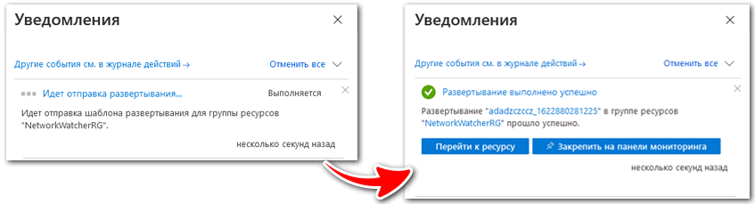
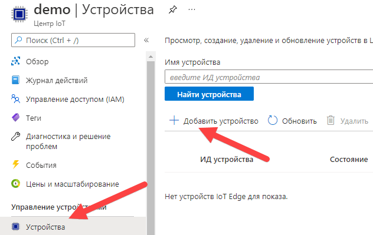
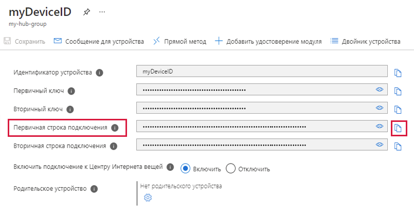
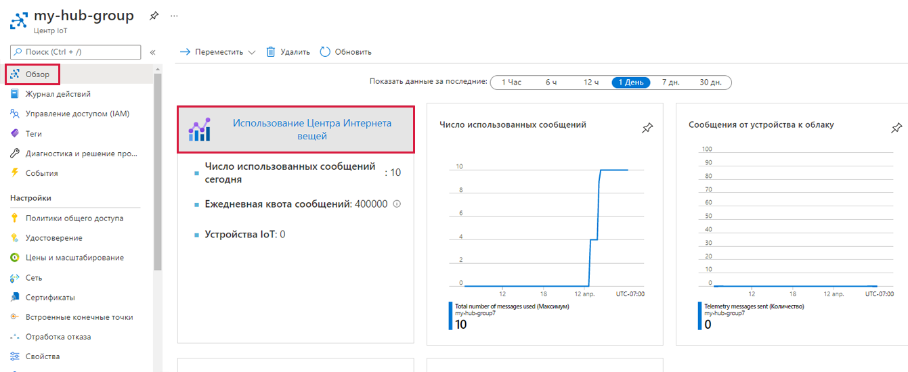

---
wts:
  title: "07\_— Внедрение Центра Интернета вещей Azure (10 мин)"
  module: 'Module 03: Describe core solutions and management tools'
---
# 07 — Внедрение Центра Интернета вещей Azure (10 мин)

In this walkthrough, we will configure a new Azure IoT Hub in Azure Portal, and then authenticate a connection to an IoT device using the online Raspberry Pi device simulator. Sensor data and messages are passed from the Raspberry Pi simulator to your Azure IoT Hub, and you view metrics for the messaging activity in Azure Portal.

# Задача 1. Создание центра Интернета вещей 

В рамках этой задачи мы создадим центр Интернета вещей. 

1. Войдите на [портал Azure](https://portal.azure.com).

2. В колонке **Все службы** найдите и выберите элемент **Центр Интернета вещей**, а затем щелкните **+ Добавить, + Создать, + Новый**.

3. На вкладке **Основные** колонки **Центр Интернета вещей** укажите в полях следующие сведения (замените **xxxx** в имени учетной записи хранения буквами и цифрами, чтобы имя было глобально уникальным):

    | Настройки | Значение |
    |--|--|
    | Подписка | **Сохранить предоставленное по умолчанию** |
    | Группа ресурсов | **Создание группы ресурсов** |
    | Имя Центра Интернета вещей | **my-hub-groupxxxxx** |
    | Регион | **Восточная часть США** |

    **Примечание.** Не забудьте заменить символы **xxxxx**, чтобы **Имя центра Интернета вещей стало уникальным**.

4. Перейдите на вкладку **Управление** и используйте раскрывающийся список, чтобы установить для параметра **Ценовая категория и категория масштабирования** значение **S1: стандартный уровень**.

5. Нажмите кнопку **Проверка и создание**.

6. Нажмите кнопку **Создать**, чтобы начать создание экземпляра Центра Интернета вещей Azure.

7. Дождитесь развертывания экземпляра Центра Интернета вещей Azure. 

# Задача 2. Добавление устройства Интернета вещей

В рамках этой задачи мы добавим устройство Интернета вещей в центр Интернета вещей. 

1. When the deployment has completed, click <bpt id="p1">**</bpt>Go to resource<ept id="p1">**</ept> from the deployment blade. Alternatively, from the <bpt id="p1">**</bpt>All services<ept id="p1">**</ept> blade, search for and select <bpt id="p2">**</bpt>IoT Hub<ept id="p2">**</ept> and locate your new IoT Hub instance

    

2. To add a new IoT device, scroll down to the <bpt id="p1">**</bpt>Device management<ept id="p1">**</ept> section and click <bpt id="p2">**</bpt>Devices<ept id="p2">**</ept>. Then, click <bpt id="p1">**</bpt>+ Add Device<ept id="p1">**</ept>.

    

3. Данные датчиков и сообщения передаются из симулятора Raspberry Pi в ваш Центр Интернета вещей Azure, и вы просматриваете метрики по обмену сообщениями на портале Azure.

4. Если вы не видите свое новое устройство, нажмите кнопку **Обновить** для обновления страницы "Устройства Интернета вещей". 

5. Select <bpt id="p1">**</bpt>myRaspberryPi<ept id="p1">**</ept> and copy the <bpt id="p2">**</bpt>Primary Connection String<ept id="p2">**</ept> value. You will use this key in the next task to authenticate a connection to the Raspberry Pi simulator.

    

# Задача 3. Тестирование устройства с помощью симулятора Raspberry Pi

В рамках этой задачи мы протестируем устройство с помощью симулятора Raspberry Pi. 

1. Open a new tab in the web browser and type this shortcut link <ph id="ph1">https://aka.ms/RaspPi</ph>. It will take you to a Raspberry Pi Simulator site. If you have time, read about the Raspberry Pi simulator. When done select "<bpt id="p1">**</bpt>X<ept id="p1">**</ept>" to close the pop-up window.

2. In the code area on the right side, locate the line with 'const connectionString ='. Replace it with the connection string you copied from the Azure portal. Note that the connection sting includes the DeviceId (<bpt id="p1">**</bpt>myRaspberryPi<ept id="p1">**</ept>) and SharedAccessKey entries.

    

3. Click <bpt id="p1">**</bpt>Run<ept id="p1">**</ept> (below the code area) to run the application. The console output should show the sensor data and messages that are sent from the Raspberry Pi simulator to your Azure IoT Hub. Data and messages are sent each time the Raspberry Pi simulator LED flashes. 

    

5. Нажмите кнопку **Остановить**, чтобы прекратить отправку данных.

6. Вернитесь на портал Azure.

7. Switch the IoT Hub <bpt id="p1">**</bpt>Overview<ept id="p1">**</ept> blade and scroll down to the <bpt id="p2">**</bpt>IoT Hub Usage<ept id="p2">**</ept> information to view usage. Change your timeframe in the <bpt id="p1">**</bpt>show data for last<ept id="p1">**</ept> to see data in the last hour.

    

Congratulations! You have set up Azure IoT Hub to collect sensor data from an IoT device.

<bpt id="p1">**</bpt>Note<ept id="p1">**</ept>: To avoid additional costs, you can optionally remove this resource group. Search for resource groups, click your resource group, and then click <bpt id="p1">**</bpt>Delete resource group<ept id="p1">**</ept>. Verify the name of the resource group and then click <bpt id="p1">**</bpt>Delete<ept id="p1">**</ept>. Monitor the <bpt id="p1">**</bpt>Notifications<ept id="p1">**</ept> to see how the delete is proceeding.
