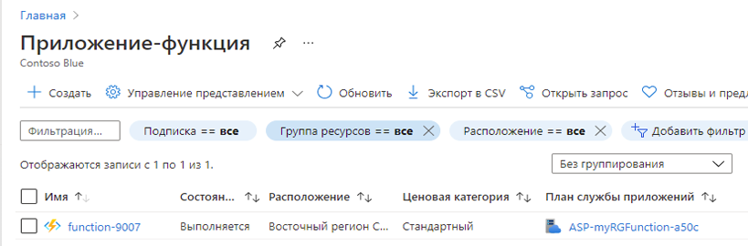
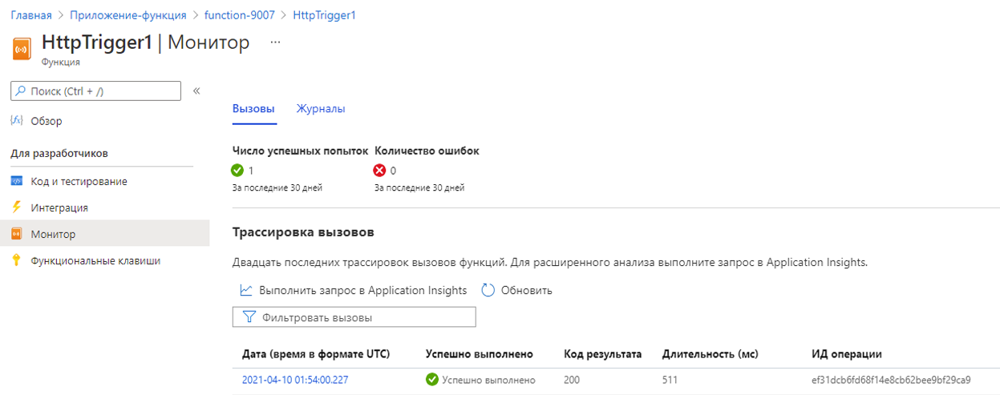

---
wts:
  title: "08\_— Реализация функций Azure (5 мин)"
  module: 'Module 03: Describe core solutions and management tools'
---
# 08 — Реализация функций Azure (5 мин)

В этом пошаговом руководстве мы создадим приложение-функцию для отображения приветственного сообщения Hello при выполнении HTTP-запроса. 

# Задача 1. Создание приложения-функции 

В рамках этой задачи мы создадим приложение-функцию.

1. Войдите на [портал Azure](https://portal.azure.com).

2. На панели **Поиск** в верхней части портала найдите и выберите элемент **Приложение-функция**, а затем в колонке **Приложение-функция** щелкните **+ Добавить, + Создать, + Новый**.

3. На вкладке **Основные** в колонке **Приложение-функция** укажите следующие параметры (замените **xxxx** в имени приложения-функции буквами и цифрами, чтобы имя было глобально уникальным, а для остальных параметров оставьте значения по умолчанию). 

    | Настройки | Значение |
    | -- | --|
    | Подписка | **Сохранить предоставленное по умолчанию** |
    | Группа ресурсов | **Создание группы ресурсов** |
    | Имя приложения-функции | **function-xxxx** |
    | Публикация | **Код** |
    | Стек среды выполнения | **.NET** |
    | Версия | **3.1** |
    | Регион | **Восточная часть США** |

    **Примечание.** Не забудьте заменить символы **xxxx**, чтобы **Имя приложения-функции** стало уникальным.

4. Щелкните **Просмотр и создание** и после успешной проверки нажмите кнопку **Создать**, чтобы начать подготовку и развертывание нового приложения-функции Azure.

5. Дождитесь уведомления о создании ресурса.

6. When the deployment has completed, click Go to resource from the deployment blade. Alternatively, navigate back to the <bpt id="p1">**</bpt>Function App<ept id="p1">**</ept> blade, click <bpt id="p2">**</bpt>Refresh<ept id="p2">**</ept> and verify that the newly created function app has the <bpt id="p3">**</bpt>Running<ept id="p3">**</ept> status. 

    

# Задача 2. Создание функции, активируемой HTTP, и тест

В рамках этой задачи мы будем использовать функцию «Веб-перехватчик + API» для отображения сообщения при выполнении HTTP-запроса. 

1. В колонке **Приложение-функция** щелкните созданное приложение-функцию. 

2. В колонке приложения-функции в разделе **Функции** щелкните **Функции**, а затем щелкните **+ Добавить, + Создать, + Новый**.

    

3. An <bpt id="p1">**</bpt>Add function<ept id="p1">**</ept> pop-up window will appear on the right. In the <bpt id="p1">**</bpt>Select a template<ept id="p1">**</ept> section click <bpt id="p2">**</bpt>HTTP trigger<ept id="p2">**</ept>. Click <bpt id="p1">**</bpt>Add<ept id="p1">**</ept> 

    

4. В колонке **HttpTrigger1** в разделе **Разработчик** щелкните **Code + Test** (Код и тест). 

5. On the <bpt id="p1">**</bpt>Code + Test<ept id="p1">**</ept> blade, review the auto-generated code and note that the code is designed to run an HTTP request and log information. Also, notice the function returns a Hello message with a name. 

    

6. Нажмите кнопку **Получить URL-адрес функции** в верхней части редактора функций. 

7. Задайте в раскрывающемся списке **Клавиша** значение **по умолчанию** и нажмите кнопку **Копировать**, чтобы скопировать URL-адрес функции. 

    

8. Open a new browser tab and paste the copied function URL into your web browser's address bar. When the page is requested the function will run. Notice the returned message stating that the function requires a name in the request body.

    

9. Добавьте **&name=*ваше_имя*** в конец URL-адреса.

    **Примечание**. Например, если ваше имя Cindy, итоговый URL-адрес будет сходен со следующим: `https://azfuncxxx.azurewebsites.net/api/HttpTrigger1?code=X9xx9999xXXXXX9x9xxxXX==&name=cindy`

    

10. When you hit enter, your function runs and every invocation is traced. To view the traces, return to the Portal <bpt id="p1">**</bpt>HttpTrigger1 <ph id="ph1">\|</ph> Code + Test<ept id="p1">**</ept> blade and click <bpt id="p2">**</bpt>Monitor<ept id="p2">**</ept>. You can <bpt id="p1">**</bpt>configure<ept id="p1">**</ept> Application Insights by selecting the timestamp and click <bpt id="p2">**</bpt>Run query in Application Insights<ept id="p2">**</ept>.

     

Congratulations! You have created a Function App to display a Hello message when there is an HTTP request.  

<bpt id="p1">**</bpt>Note<ept id="p1">**</ept>: To avoid additional costs, you can optionally remove this resource group. Search for resource groups, click your resource group, and then click <bpt id="p1">**</bpt>Delete resource group<ept id="p1">**</ept>. Verify the name of the resource group and then click <bpt id="p1">**</bpt>Delete<ept id="p1">**</ept>. Monitor the <bpt id="p1">**</bpt>Notifications<ept id="p1">**</ept> to see how the delete is proceeding.
