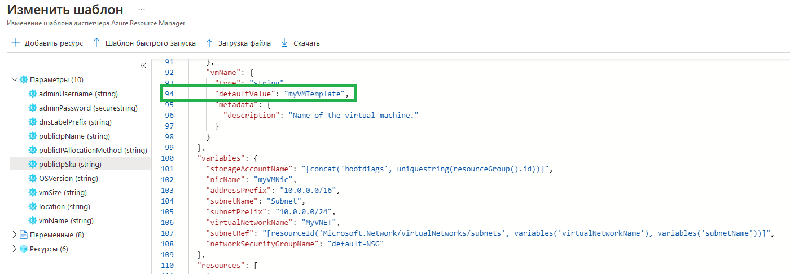

---
wts:
  title: "09\_— Создание виртуальной машины с использованием шаблона (10 мин)"
  module: 'Module 03: Describe core solutions and management tools'
---
# 09 — Создание виртуальной машины с использованием шаблона (10 мин)

В этом пошаговом руководстве мы развернем виртуальную машину с помощью шаблона быстрого запуска и рассмотрим возможности мониторинга.

# Задача 1. Изучите галерею QuickStart и определите местоположение шаблона. 

В рамках этой задачи мы просмотрим коллекцию шаблонов быстрого запуска Azure и развернем шаблон, создающий виртуальную машину. 

1. Within the lab environment, open a new browser window, and enter T <ph id="ph1">https://azure.microsoft.com/en-us/resources/templates/?azure-portal=true</ph>. In the gallery you will find a number of popular and recently updated templates. These templates automate deployment of Azure resources, including installation of popular software packages. Browse through the many different types of templates that are available.

3. Выберите **Развертывание простой ВМ Windows**

4. Click the <bpt id="p1">**</bpt>Deploy to Azure<ept id="p1">**</ept> button. Your browser session will be automatically redirected to the <bpt id="p1">[</bpt>Azure portal<ept id="p1">](http://portal.azure.com/)</ept>.

  <bpt id="p1">**</bpt>Note<ept id="p1">**</ept>: The <bpt id="p2">**</bpt>Deploy to Azure<ept id="p2">**</ept> button enables you to deploy the template via the Azure portal. During such deployment, you will be prompted only for small set of configuration parameters. 

5. При появлении запроса войдите в подписку Azure, используя учетные данные, указанные в инструкциях ранее.

6. Click <bpt id="p1">**</bpt>Edit template<ept id="p1">**</ept>. The Resource Manager template format uses the JSON format. Review the parameters and variables.  Then locate the parameter for virtual machine name. Change the name to <bpt id="p1">**</bpt>myVMTemplate<ept id="p1">**</ept>. <bpt id="p1">**</bpt>Save<ept id="p1">**</ept> your changes. 

    

7. Now configure the parameters required by the template (replace <bpt id="p1">***</bpt>xxxx<ept id="p1">***</ept> in the DNS label prefix with letters and digits such that the label is globally unique). Leave the defaults for everything else. 

    | Параметр| Значение|
    |----|----|
    | Подписка | **Сохранить предоставленное по умолчанию**|
    | Группа ресурсов | **Создание группы ресурсов** |
    | Регион | Сохранить по умолчанию |
    | Имя администратора | **azureuser** |
    | Пароль администратора | **Pa$$w0rd1234** |
    | Префикс DNS-метки | **myvmtemplatexxxx** |
    | Версия ОС | **2019-Datacenter** |

9. Щелкните **Просмотр и создание**.

10. Следите за развертыванием. 

# Задача 2. Проверка и мониторинг развертывания виртуальной машины

В рамках этой задачи мы проверим правильность развертывания виртуальной машины. 

1. В колонке **Все службы** найдите и выберите элемент **Виртуальные машины**.

2. Убедитесь, что виртуальная машина создана. 

    

3. Выберите свою виртуальную машину и в области **Обзор** выберите вкладку **Отслеживание**, прокрутите вниз, чтобы просмотреть данные мониторинга.

    **Примечание**. Временной интервал мониторинга можно регулировать в пределах от одного часа до 30 дней.

4. Просмотрите различные представленные диаграммы, включая **Средняя загрузка ЦП**, **Сеть (общая)** и **Байт диска (всего)** . 

    

5. В лабораторной среде откройте новое окно браузера и введите T https://azure.microsoft.com/en-us/resources/templates/?azure-portal=true.

6. Там вы увидите ряд популярных и недавно обновленных шаблонов.
7. Они автоматизируют развертывание ресурсов Azure, включая установку популярных программных пакетов. 

8. Щелкните **Добавить фильтр** и поэкспериментируйте с поиском различных типов событий и операций. 

    

Просмотрите разные типы шаблонов, которые вам доступны.

<bpt id="p1">**</bpt>Note<ept id="p1">**</ept>: To avoid additional costs, you can optionally remove this resource group. Search for resource groups, click your resource group, and then click <bpt id="p1">**</bpt>Delete resource group<ept id="p1">**</ept>. Verify the name of the resource group and then click <bpt id="p1">**</bpt>Delete<ept id="p1">**</ept>. Monitor the <bpt id="p1">**</bpt>Notifications<ept id="p1">**</ept> to see how the delete is proceeding.
