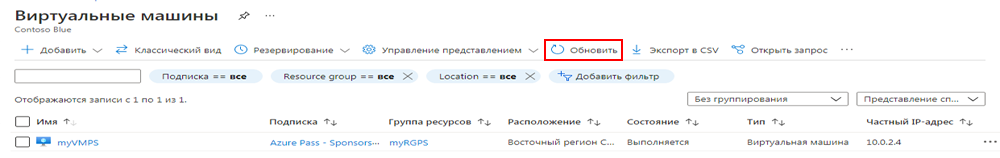

---
wts:
  title: "10\_— Создание виртуальной машины с использованием PowerShell (10 мин)"
  module: 'Module 03: Describe core solutions and management tools'
---
# <a name="10---create-a-vm-with-powershell-10-min"></a>10 — Создание виртуальной машины с использованием PowerShell (10 мин)

В этом пошаговом руководстве мы настроим Cloud Shell, воспользуемся модулем Azure PowerShell для создания группы ресурсов и виртуальной машины, а также рассмотрим рекомендации Помощника по Azure. 

# <a name="task-1-configure-the-cloud-shell"></a>Задача 1. Настройка Cloud Shell 

В рамках этой задачи мы настроим Cloud Shell. 

1. Войдите на [портал Azure](https://portal.azure.com).** Вы можете найти свои учетные данные для входа на вкладке ресурсов (непосредственно рядом с этой вкладкой инструкций!) **
2. На портале Azure откройте **Azure Cloud Shell**, щелкнув значок в правом верхнем углу портала Azure.

    

3. Когда будет предложено выбрать **Bash** или **PowerShell**, выберите **PowerShell**.

4. На экране **У вас нет подключенного хранилища** выберите **Показать дополнительные настройки**, а затем введите приведенную ниже информацию

    | Параметры | Значения |
    |  -- | -- |
    | Группа ресурсов | **Создание группы ресурсов** |
    | Учетная запись хранения (создайте новую учетную запись, используя глобальное уникальное имя (напр.: cloudshellstoragemystorage)) | **cloudshellxxxxxxx** |
    | Общая папка (создайте новую) | **shellstorage** |

5. Выберите **Создать хранилище**.

# <a name="task-2-create-a-resource-group-and-virtual-machine"></a>Задача 2. Создание группы ресурсов и виртуальной машины

В этой задаче мы будем использовать PowerShell для создания группы ресурсов и виртуальной машины.  

1. Выберите **PowerShell** в верхнем левом раскрывающемся меню на панели Cloud Shell.

2. Verify your new resource group by running the following command in the Powershell window. Press <bpt id="p1">**</bpt>Enter<ept id="p1">**</ept> to run the command.

    ```PowerShell
    Get-AzResourceGroup | Format-Table
    ```

3. Создайте виртуальную машину, вставив следующую команду в окно терминала. 

    ```PowerShell
    New-AzVm `
    -ResourceGroupName "myRGPS" `
    -Name "myVMPS" `
    -Location "East US" `
    -VirtualNetworkName "myVnetPS" `
    -SubnetName "mySubnetPS" `
    -SecurityGroupName "myNSGPS" `
    -PublicIpAddressName "myPublicIpPS"
    ```
    
4. При появлении запроса укажите имя пользователя (**azureuser**) и пароль (**Pa$$w0rd1234**), которые будут настроены в качестве учетной записи локального администратора на этих виртуальных машинах.azureadmin

5. После создания ВМ закройте панель Cloud Shell сеанса PowerShell.

6. In the Azure portal, search for <bpt id="p1">**</bpt>Virtual machines<ept id="p1">**</ept> and verify the <bpt id="p2">**</bpt>myVMPS<ept id="p2">**</ept> is running. This may take a few minutes.

    

7. Получите доступ к новой виртуальной машине и просмотрите параметры «Обзор» и «Сеть», чтобы убедиться, что ваша информация была развернута правильно. 

# <a name="task-3-execute-commands-in-the-cloud-shell"></a>Задача 3. Выполнение команд в Cloud Shell

В рамках этой задачи мы попрактикуемся в выполнении команд PowerShell из Cloud Shell. 

1. На портале Azure откройте **Azure Cloud Shell**, щелкнув значок в правом верхнем углу портала Azure.

2. Выберите **PowerShell** в верхнем левом раскрывающемся меню на панели Cloud Shell.

3. Retrieve information about your virtual machine including name, resource group, location, and status. Notice the PowerState is <bpt id="p1">**</bpt>running<ept id="p1">**</ept>.

    ```PowerShell
    Get-AzVM -name myVMPS -status | Format-Table -autosize
    ```

4. Остановите виртуальную машину с помощью следующей команды. 

    ```PowerShell
    Stop-AzVM -ResourceGroupName myRGPS -Name myVMPS
    ```
5. When prompted confirm (Yes) to the action. Wait for <bpt id="p1">**</bpt>Succeeded<ept id="p1">**</ept> status.

6. Verify your virtual machine state. The PowerState should now be <bpt id="p1">**</bpt>deallocated<ept id="p1">**</ept>. You can also verify the virtual machine status in the portal. Close Cloudshell.

    ```PowerShell
    Get-AzVM -name myVMPS -status | Format-Table -autosize
    ```

# <a name="task-4-review-azure-advisor-recommendations"></a>Задача 4. Ознакомление с рекомендациями Помощника по Azure

**Примечание**. Эта же задача приведена в задании «Создание виртуальной машины с использованием Azure CLI». 

В рамках этой задачи мы рассмотрим рекомендации Помощника по Azure для нашей виртуальной машины. 

1. В колонке **Все службы** найдите и выберите элемент **Помощник**. 

2. On the <bpt id="p1">**</bpt>Advisor<ept id="p1">**</ept> blade, select <bpt id="p2">**</bpt>Overview<ept id="p2">**</ept>. Notice recommendations are grouped by Reliability, Security, Performance, and Cost. 

    

3. Выберите **Все рекомендации** и уделите время просмотру каждой рекомендации и предлагаемых действий. 

    **Примечание**. В зависимости от ваших ресурсов рекомендации будут различаться. 

    

4. Обратите внимание, что вы можете скачать рекомендации в виде файла CSV или PDF. 

5. Обратите внимание, что вы можете создавать оповещения. 

6. Если у вас есть время, продолжайте экспериментировать с Azure PowerShell. 

Congratulations! You have configured Cloud Shell, created a virtual machine using PowerShell, practiced with PowerShell commands, and viewed Advisor recommendations.

<bpt id="p1">**</bpt>Note<ept id="p1">**</ept>: To avoid additional costs, you can optionally remove this resource group. Search for resource groups, click your resource group, and then click <bpt id="p1">**</bpt>Delete resource group<ept id="p1">**</ept>. Verify the name of the resource group and then click <bpt id="p1">**</bpt>Delete<ept id="p1">**</ept>. Monitor the <bpt id="p1">**</bpt>Notifications<ept id="p1">**</ept> to see how the delete is proceeding.
