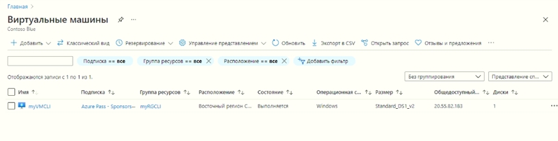

---
wts:
  title: "11\_— Создание виртуальной машины с использованием CLI (10 мин)"
  module: 'Module 03: Describe core solutions and management tools'
---
# <a name="11---create-a-vm-with-the-cli-10-min"></a>11 — Создание виртуальной машины с использованием CLI (10 мин)

В этом пошаговом руководстве мы настроим Cloud Shell, воспользуемся Azure CLI для создания группы ресурсов и виртуальной машины, а также рассмотрим рекомендации Помощника по Azure. 

# <a name="task-1-configure-the-cloud-shell"></a>Задача 1. Настройка Cloud Shell 

В этой задаче мы настроим Cloud Shell, а затем используем Azure CLI для создания группы ресурсов и виртуальной машины.  

1. Войдите на [портал Azure](https://portal.azure.com).

2. На портале Azure откройте **Azure Cloud Shell**, щелкнув значок в правом верхнем углу портала Azure.

    
   
3. В диалоговом окне приветствия Azure Cloud Shell при выводе приглашения выбрать **Bash** либо **PowerShell** выберите **Bash**. 

4. A new window will open stating <bpt id="p1">**</bpt>You have no storage mounted<ept id="p1">**</ept>. Select <bpt id="p1">**</bpt>advanced settings<ept id="p1">**</ept>.

5. На экране дополнительных параметров заполните следующие поля, а затем щелкните «Создать группу»:
    - Группа ресурсов: **Создание новой группы ресурсов**
    - Учетная запись хранения. Создайте новую учетную запись, используя глобальное уникальное имя (напр.: cloudshellxyzstorage)
    - Общая папка: Создайте новую папку и назовите ее cloudshellfileshare.


# <a name="task-2-use-cli-to-create-a-virtual-machine"></a>Задача 2. Использование CLI для создания виртуальной машины

В этой задаче мы будем использовать Azure CLI для создания группы ресурсов и виртуальной машины.

1. Выберите **Bash** в верхнем левом раскрывающемся меню на панели Cloud Shell.

    


2. Проверьте используемую вами группу ресурсов, введя следующую команду.

    ```cli
    az group list --output table
    ```

4. In Cloud Shell enter the command below and make sure that each line, except for the last one, is followed by the backslash (<ph id="ph1">`\`</ph>) character. If you type the whole command on the same line, do not use any backslash characters. 

    ```cli
    az vm create \
    --name myVMCLI \
    --resource-group myRGCLI \
    --image UbuntuLTS \
    --location EastUS2 \
    --admin-username azureuser \
    --admin-password Pa$$w0rd1234
    ```

    >**Примечание**. Если вы используете командную строку на компьютере с Windows, замените обратную косую черту ("`\`") символом крышки ("`^`").

    <bpt id="p1">**</bpt>Note<ept id="p1">**</ept>: The command will take 2 to 3 minutes to complete. The command will create a virtual machine and various resources associated with it such as storage, networking and security resources. Do not continue to the next step until the virtual machine deployment is complete. 

5. Когда команда завершит выполнение, закройте панель Cloud Shell в окне браузера.

6. На портале Azure выполните поиск элемента **Виртуальные машины** и убедитесь, что **myVMCLI** выполняется.

    


# <a name="task-3-execute-commands-in-the-cloud-shell"></a>Задача 3. Выполнение команд в Cloud Shell

В рамках этой задачи мы попрактикуемся в выполнении команд CLI из Cloud Shell. 

1. На портале Azure откройте **Azure Cloud Shell**, щелкнув значок в правом верхнем углу портала Azure.

2. Выберите **Bash** в верхнем левом раскрывающемся меню на панели Cloud Shell.

3. Retrieve information about the virtual machine you provisioned, including name, resource group, location, and status. Notice the PowerState is <bpt id="p1">**</bpt>running<ept id="p1">**</ept>.

    ```cli
    az vm show --resource-group myRGCLI --name myVMCLI --show-details --output table 
    ```

4. Stop the virtual machine. Notice the message that billing continues until the virtual machine is deallocated. 

    ```cli
    az vm stop --resource-group myRGCLI --name myVMCLI
    ```

5. Verify your virtual machine status. The PowerState should now be <bpt id="p1">**</bpt>stopped<ept id="p1">**</ept>.

    ```cli
    az vm show --resource-group myRGCLI --name myVMCLI --show-details --output table 
    ```

# <a name="task-4-review-azure-advisor-recommendations"></a>Задача 4. Ознакомление с рекомендациями Помощника по Azure

В рамках этой задачи мы рассмотрим рекомендации Помощника по Azure.

   **Примечание**. Если вы завершили предыдущее задание ("Создание виртуальной машины с помощью PowerShell"), значит, вы уже выполнили эту задачу. 

1. В колонке **Все службы** найдите и выберите элемент **Помощник**. 

2. On the <bpt id="p1">**</bpt>Advisor<ept id="p1">**</ept> blade, select <bpt id="p2">**</bpt>Overview<ept id="p2">**</ept>. Notice recommendations are grouped by Reliability, Security, Performance, and Cost. 

    

3. Выберите **Все рекомендации** и уделите время просмотру каждой рекомендации и предлагаемых действий. 

    **Примечание**. В зависимости от ваших ресурсов рекомендации будут различаться. 

    

4. Обратите внимание, что вы можете скачать рекомендации в виде файла CSV или PDF. 

5. Обратите внимание, что вы можете создавать оповещения. 

6. Если у вас есть время, продолжайте экспериментировать с Azure CLI. 

Congratulations! You have configured Cloud Shell, created a virtual machine using Azure CLI, practiced with Azure CLI commands, and viewed Advisor recommendations.

<bpt id="p1">**</bpt>Note<ept id="p1">**</ept>: To avoid additional costs, you can optionally remove this resource group. Search for resource groups, click your resource group, and then click <bpt id="p1">**</bpt>Delete resource group<ept id="p1">**</ept>. Verify the name of the resource group and then click <bpt id="p1">**</bpt>Delete<ept id="p1">**</ept>. Monitor the <bpt id="p1">**</bpt>Notifications<ept id="p1">**</ept> to see how the delete is proceeding.
