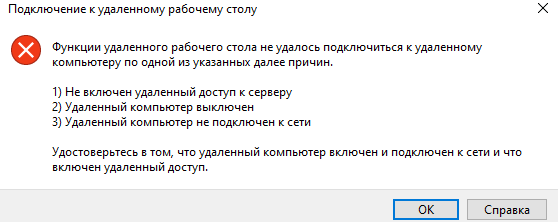

---
wts:
  title: "13\_— Безопасный сетевой трафик (10\_мин)"
  module: 'Module 04: Describe general security and network security features'
---
# 13 — Безопасный сетевой трафик (10 мин)

В этом пошаговом руководстве мы настроим группу безопасности сети.

# Задача 1. Создание виртуальной машины

В рамках этой задачи мы создадим виртуальную машину Windows Server 2019 Datacenter. 

1. Войдите на [портал Azure](https://portal.azure.com).

2. В колонке **Все службы** найдите и выберите элемент **Виртуальные машины**, а затем щелкните **+ Добавить, + Создать, + Новый** для виртуальной машины.

3. На вкладке **Основные** укажите следующие сведения (для остальных параметров оставьте значения по умолчанию):

    | Параметры | Значения |
    |  -- | -- |
    | Подписка | **Используйте предоставленные значения по умолчанию** |
    | Группа ресурсов | **Создание группы ресурсов** |
    | Имя виртуальной машины | **SimpleWinVM** |
    | Регион | **Восточная часть США (США)**|
    | Image | **Windows Server 2019 Datacenter — поколение 2**|
    | Размер | **Standard D2s v3**|
    | Имя пользователя учетной записи администратора | **azureuser** |
    | Пароль учетной записи администратора | **Pa$$w0rd1234**|
    | Правила для входящих портов | **None**|

4. Перейдите на вкладку **Сеть** и настройте следующие параметры:

    | Параметры | Значения |
    | -- | -- |
    | Сетевая группа безопасности сетевого адаптера | **None**|

5. Перейдите на вкладку **Управление** и в разделе **Мониторинг** выберите следующий параметр:

    | Параметры | Значения |
    | -- | -- |
    | Диагностика загрузки | **Отключить**|

6. Для остальных параметров оставьте значения по умолчанию и нажмите кнопку **Просмотр и создание** в нижней части страницы.

7. Once Validation is passed click the <bpt id="p1">**</bpt>Create<ept id="p1">**</ept> button. It can take about five minutes to deploy the virtual machine.

8. Monitor the deployment. It may take a few minutes for the resource group and virtual machine to be created. 

9. В колонке развертывания или области уведомлений щелкните **Перейти к ресурсу**. 

10. В колонке виртуальной машины **SimpleWinVM** щелкните **Сеть**, просмотрите вкладку **Правила входящего порта** и обратите внимание на то, что нет группы безопасности сети, связанной с сетевым интерфейсом виртуальной машины или подсетью, к которой подключен сетевой интерфейс.

    <bpt id="p1">**</bpt>Note<ept id="p1">**</ept>: Identify the name of the network interface. You will need it in the next task.

# Задача 2. Создание группы безопасности сети

В рамках этой задачи мы создадим группу безопасности сети и свяжем ее с сетевым интерфейсом. 

1. В колонке **Все службы** найдите и выберите элемент **Группы безопасности сети**, а затем щелкните **+ Добавить, + Создать, + Новый**.

2. На вкладке **Основные** в колонке **Создание группы безопасности сети** укажите следующие параметры.

    | Параметр | Значение |
    | -- | -- |
    | Подписка | **Использовать подписку по умолчанию** |
    | Группа ресурсов | **Выберите значение по умолчанию в раскрывающемся списке** |
    | Название | **myNSGSecure** |
    | Регион | **Восточная часть США (США)**  |

3. Нажмите кнопку **Просмотр и создание**, а затем после проверки нажмите кнопку **Создать**.

4. После создания группы безопасности сети щелкните **Перейти к ресурсу**.

5. В разделе **Параметры** щелкните **Сетевые интерфейсы** и затем ** Привязать**.

6. Выберите сетевой интерфейс, указанный в предыдущей задаче. 

# Задача 3. Настройка правила входящего порта безопасности для разрешения RDP

В рамках этой задачи мы разрешим трафик RDP на виртуальную машину, настроив правило входящего порта безопасности. 

1. На портале Azure перейдите к колонке виртуальной машины **SimpleWinVM**. 

2. На панели **Обзор** щелкните **Подключить**.

3. Attempt to connect to the virtual machine by selecting RDP and downloading an running the RDP file. By default the network security group does not allow RDP. Close the error window. 

    

4. В колонке виртуальной машины прокрутите вниз до раздела **Параметры**, щелкните **Сеть** и обратите внимание, что правила для входящего трафика для группы безопасности сети **myNSGSecure (подключено к сетевому интерфейсу: myVMNic)** запрещают весь входящий трафик, кроме трафика в виртуальной сети и проб подсистемы балансировки нагрузки.

5. On the <bpt id="p1">**</bpt>Inbound port rules<ept id="p1">**</ept> tab, click <bpt id="p2">**</bpt>Add inbound port rule<ept id="p2">**</ept> . Click <bpt id="p1">**</bpt>Add<ept id="p1">**</ept> when you are done. 

    | Параметр | Значение |
    | -- | -- |
    | Источник | **Любые**|
    | Диапазоны исходных портов | **\*** |
    | Назначение | **Любые** |
    | Диапазоны портов назначения | **3389** |
    | Протокол | **TCP** |
    | Действие | **Разрешить** |
    | Приоритет | **300** |
    | Название | **AllowRDP** |

6. Select <bpt id="p1">**</bpt>Add<ept id="p1">**</ept> and wait for the rule to be provisioned and then try again to RDP into the virtual machine by going back to <bpt id="p2">**</bpt>Connect<ept id="p2">**</ept> This time you should be successful. Remember the user is <bpt id="p1">**</bpt>azureuser<ept id="p1">**</ept> and the password is <bpt id="p2">**</bpt>Pa$$w0rd1234<ept id="p2">**</ept>.

# Задача 4. Настройка правила исходящего порта безопасности для запрета доступа в Интернет

В рамках этой задачи мы создадим правило исходящего порта NSG, которое запретит доступ в Интернет, а затем протестируем его, чтобы убедиться, что правило работает.

1. Продолжите работу в сеансе RDP виртуальной машины. 

2. После запуска компьютера откройте браузер **Internet Explorer**. 

3. Verify that you can access <bpt id="p1">**</bpt><ph id="ph1">https://www.bing.com</ph><ept id="p1">**</ept> and then close Internet Explorer. You will need to work through the IE enhanced security pop-ups. 

    **Примечание**. Теперь мы настроим правило для запрета исходящего доступа в Интернет. 

4. Вернитесь на портал Azure в колонку виртуальной машины **SimpleWinVM**. 

5. В разделе **Параметры** щелкните **Сеть** и затем **Правила исходящего порта**.

6. Notice there is a rule, <bpt id="p1">**</bpt>AllowInternetOutbound<ept id="p1">**</ept>. This a default rule and cannot be removed. 

7. Click <bpt id="p1">**</bpt>Add outbound port rule<ept id="p1">**</ept> to the right of the <bpt id="p2">**</bpt>myNSGSecure  (attached to network interface: myVMNic)<ept id="p2">**</ept> network security group and configure a new outbound security rule with a higher priority that will deny internet traffic. Click <bpt id="p1">**</bpt>Add<ept id="p1">**</ept> when you are finished. 

    | Параметр | Значение |
    | -- | -- |
    | Источник | **Любые**|
    | Диапазоны исходных портов | **\*** |
    | Назначение | **Тег службы** |
    | Тег целевой службы | **Интернет**; |
    | Диапазоны портов назначения | **\*** |
    | Протокол | **TCP** |
    | Действие | **Запретить** |
    | Приоритет | **4000** |
    | Название | **DenyInternet** |

8. Щелкните **Добавить**. Вернитесь на виртуальную машину, для которой использовался RDP. 

9. Browse to <bpt id="p1">**</bpt><ph id="ph1">https://www.microsoft.com</ph><ept id="p1">**</ept>. The page should not display. You may need to work through additional IE enhanced security pop-ups.  

<bpt id="p1">**</bpt>Note<ept id="p1">**</ept>: To avoid additional costs, you can optionally remove this resource group. Search for resource groups, click your resource group, and then click <bpt id="p1">**</bpt>Delete resource group<ept id="p1">**</ept>. Verify the name of the resource group and then click <bpt id="p1">**</bpt>Delete<ept id="p1">**</ept>. Monitor the <bpt id="p1">**</bpt>Notifications<ept id="p1">**</ept> to see how the delete is proceeding.
