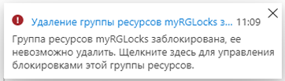
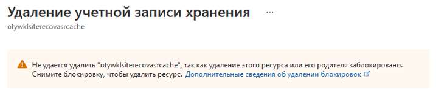

---
wts:
  title: "15\_— Управление блокировками ресурсов (5 мин)"
  module: 'Module 05: Describe identity, governance, privacy, and compliance features'
---
# 15 — Управление блокировками ресурсов (5 мин)

In this walkthrough, we will add a lock to the resource group and test deleting the resource group. Locks can be applied in a subscription to resource groups, or individual resources to prevent accidental deletion or modification of critical resources.  

# Задача 1.  Добавление блокировки для группы ресурсов и проверка удаления

В рамках этой задачи мы добавим блокировку ресурса для группы ресурсов и проверим удаление этой группы ресурсов. 

1. Войдите на [портал Azure](https://portal.azure.com).

2. На портале Azure перейдите к группе ресурсов **myRGLocks**.

3. Вы можете применить блокировку к подписке, группе ресурсов или отдельному ресурсу, чтобы предотвратить случайное удаление или изменение критически важных ресурсов. 

4. В разделе **Параметры** щелкните **Блокировки**, а затем **+ Добавить**. 

    

5. Configure the new lock. When you are done click <bpt id="p1">**</bpt>OK<ept id="p1">**</ept>. 

    | Параметр | Значение |
    | -- | -- |
    | Имя блокировки | '''RGLock''' |
    | Тип блокировки | **Удалить** |
    | | |

6. Click <bpt id="p1">**</bpt>Overview<ept id="p1">**</ept> and click <bpt id="p2">**</bpt>Delete resource group<ept id="p2">**</ept>. Type the name of the resource group and click <bpt id="p1">**</bpt>OK<ept id="p1">**</ept>. You receive an error message stating the resource group is locked and can't be deleted.

    

# Задача 2. Проверка удаления члена группы ресурсов

В рамках этой задачи мы проверим, защищает ли блокировка ресурса учетную запись хранения в группе ресурсов. 

1. В колонке **Все службы** найдите и выберите элемент **Учетные записи хранения**, а затем щелкните **+ Добавить, + Создать или + Новый**. 

2. В этом пошаговом руководстве мы добавим блокировку для группы ресурсов и проверим удаление этой группы ресурсов.

    | Параметр | Значение | 
    | --- | --- |
    | Подписка | **Выберите подписку** |
    | Группа ресурсов | **myRGLocks** |
    | Имя учетной записи хранения | **storageaccountxxxx** |
    | Расположение | **Восточная часть США (США)**  |
    | Производительность | **Standard Edition** |
    | Тип учетной записи | **StorageV2 (учетная запись общего назначения версии 2)** |
    | Репликация | **Локально избыточное хранилище (LRS)** |
    | Уровень доступа (по умолчанию) | **Горячий уровень хранилища** |
   

3. Щелкните **Просмотр и создание**, чтобы просмотреть параметры учетной записи хранения и разрешить Azure проверить конфигурацию. 

4. Блокировки можно применять в подписке по отношению к группам ресурсов или отдельным ресурсам, чтобы предотвратить случайное удаление или изменение критически важных ресурсов. 

5.  Дождитесь уведомления об успешном создании учетной записи хранения. 

6. Access your new storage account and from the <bpt id="p1">**</bpt>Overview<ept id="p1">**</ept> pane, click <bpt id="p2">**</bpt>Delete<ept id="p2">**</ept>. You receive an error message stating the resource or its parent has a delete lock. 

    

    <bpt id="p1">**</bpt>Note<ept id="p1">**</ept>: Although we did not create a lock specifically for the storage account, we did create a lock at the resource group level, which contains the storage account. As such, this <bpt id="p1">*</bpt>parent<ept id="p1">*</ept> level lock prevents us from deleting the resource and the storage account inherits the lock from the parent.

# Задача 3. Снятие блокировки ресурса

В рамках этой задачи мы снимем блокировку ресурса и проведем проверку. 

1. Вернитесь к колонке группы ресурсов **myRGLocks-XXXXXXXX** и в разделе **Параметры** щелкните **Блокировки**.
    
2. Щелкните ссылку **Удалить**, которая является крайней справа от записи **myRGLocks-XXXXXXXX** и находится справа от элемента **Изменить**.

    

3. Вернитесь в колонку учетной записи хранения и подтвердите, что теперь ресурс можно удалить.

Congratulations! You created a resource group, added a lock to resource group and tested deletion, tested deleting a resource in the resource group, and removed the resource lock. 

<bpt id="p1">**</bpt>Note<ept id="p1">**</ept>: To avoid additional costs, you can optionally remove this resource group. Search for resource groups, click your resource group, and then click <bpt id="p1">**</bpt>Delete resource group<ept id="p1">**</ept>. Verify the name of the resource group and then click <bpt id="p1">**</bpt>Delete<ept id="p1">**</ept>. Monitor the <bpt id="p1">**</bpt>Notifications<ept id="p1">**</ept> to see how the delete is proceeding.
