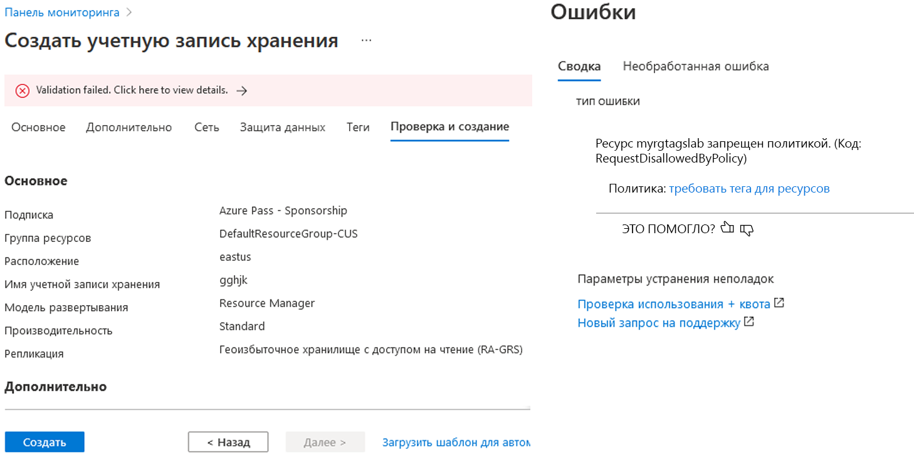
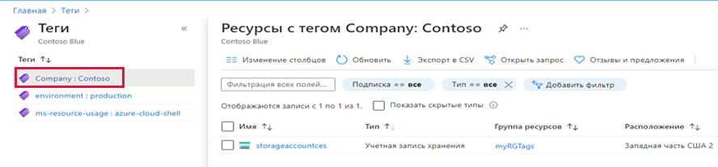
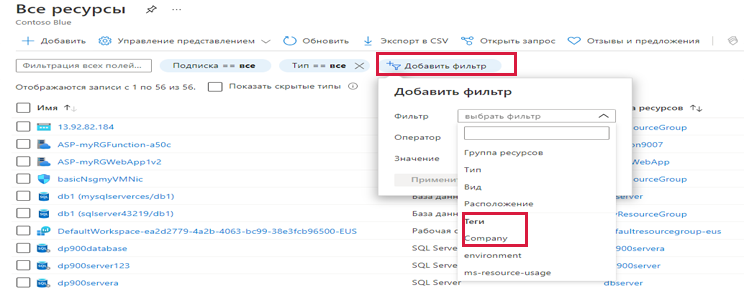

---
wts:
  title: "16\_— Реализация расстановки тегов для ресурсов (5 мин)"
  module: 'Module 05: Describe identity, governance, privacy, and compliance features'
---
# 16 — Реализация расстановки тегов для ресурсов (5 мин)

В этом пошаговом руководстве мы создадим назначение политики, которое требует расстановки тегов, создадим учетную запись хранения и проверим расстановку тегов, просмотрим ресурсы с указанным тегом, а также удалим политику расстановки тегов.

# Задача 1. Создание назначения политики 

В рамках этой задачи мы настроим политику **Требование тега в ресурсах** и назначим ее своей подписке. 

1. Войдите на [портал Azure](https://portal.azure.com).

2. В колонке **Все службы** найдите и выберите элемент **Политика**.

3. Прокрутите вниз до раздела **Разработка**, щелкните **Назначения**, а затем щелкните **Назначить политику** в верхней части страницы.

4. Обратите внимание, что **Область** нашей политики будет распространяться на всю подписку. 

5. Under <bpt id="p1">**</bpt>Basics<ept id="p1">**</ept> Select the <bpt id="p2">**</bpt>Policy definition<ept id="p2">**</ept> ellipsis button (right side of textbox). In the <bpt id="p1">**</bpt>Search<ept id="p1">**</ept> box, enter the value <bpt id="p2">**</bpt>tag<ept id="p2">**</ept>. A list of related Policies with the word <bpt id="p1">**</bpt>tag<ept id="p1">**</ept> will appear. Scroll down till you find the <bpt id="p1">**</bpt>Require a tag and its value on resources<ept id="p1">**</ept> definition, click on it and click <bpt id="p2">**</bpt>Select<ept id="p2">**</ept>.

   
   
6.  On the <bpt id="p1">**</bpt>Parameters<ept id="p1">**</ept> tab, type in **Company : Contoso ** for the tag key/value pair name. Click <bpt id="p1">**</bpt>Review + create<ept id="p1">**</ept>, and then <bpt id="p2">**</bpt>Create<ept id="p2">**</ept>.

  

7. The <bpt id="p1">**</bpt>Require a tag amd its value on resources<ept id="p1">**</ept> policy assignment is now in place. When a resource is created, it must include a tag with the Company : Contoso key.
   <bpt id="p1">**</bpt>Note - you need to wait up to 30 minutes for the Policy to be applied.<ept id="p1">**</ept> 

  

# Задача 2. Создание учетной записи хранения для проверки требуемой расстановки тегов

В рамках этой задачи мы создадим учетные записи хранения, чтобы проверить требуемую расстановку тегов. 

1. На портале Azure в колонке **Все службы** найдите и выберите элемент **Учетные записи хранения**, а затем щелкните **+Добавить +Новый +Создать**.

2. On the <bpt id="p1">**</bpt>Basics<ept id="p1">**</ept> tab of the <bpt id="p2">**</bpt>Create storage account<ept id="p2">**</ept> blade, fill in the following information (replace <bpt id="p3">**</bpt>xxxx<ept id="p3">**</ept> in the name of the storage account with letters and digits such that the name is globally unique). Leave the defaults for everything else.

    | Параметр | Значение | 
    | --- | --- |
    | Подписка | **Используйте предоставленные значения по умолчанию** |
    | Группа ресурсов | **Создание группы ресурсов** |
    | Имя учетной записи хранения | **storageaccountxxxx** |
    | Расположение | **Восточная часть США (США)** |

3. Щелкните **Review + create** (Просмотреть и создать). 

    <bpt id="p1">**</bpt>Note:<ept id="p1">**</ept> We are testing to see what happens when the tag is not supplied. Please note, it can take up to 30 minutes for Policies to take effect.

4. You will receive a Validation failed message. Click the <bpt id="p1">**</bpt>Click here to view details<ept id="p1">**</ept> message. On the <bpt id="p1">**</bpt>Errors<ept id="p1">**</ept> blade, on the <bpt id="p2">**</bpt>Summary<ept id="p2">**</ept> tab note the error message stating that resource was disallowed by Policy.

    **Примечание**. Если вы просмотрите вкладку «Необработанная ошибка», то увидите  конкретное имя тега, которое необходимо. 

    

5. Close the <bpt id="p1">**</bpt>Error<ept id="p1">**</ept> pane and click <bpt id="p2">**</bpt>Previous<ept id="p2">**</ept> (bottom of the screen). Provide the tagging information. 

    | Параметр | Значение | 
    | --- | --- |
    | Имя тега | **Company : Contoso** (может отсутствовать в раскрывающемся списке) |

6. Click <bpt id="p1">**</bpt>Review + create<ept id="p1">**</ept> and verify that the validation was successful. Click <bpt id="p1">**</bpt>Create<ept id="p1">**</ept> to deploy the storage account. 

# Задача 3. Просмотр всех ресурсов с определенным тегом

1. На портале Azure в колонке **Все службы** найдите и выберите элемент **Теги**.

2. Note all tags and their values. Click the <bpt id="p1">**</bpt>Company : Contoso<ept id="p1">**</ept> key/value pair. This will display a blade showing the newly created storage account, as long as you included the tag during its deployment. 

   

3. На портале откройте колонку **Все ресурсы**.

4. Click <bpt id="p1">**</bpt>Add filter<ept id="p1">**</ept> and add the <bpt id="p2">**</bpt>Company<ept id="p2">**</ept> tag key as the filter category. With the filter applied, only your storage account will be listed.

    

# Задача 4. Удаление назначения политики

В рамках этой задачи мы удалим политику **Требование тега в ресурсах**, чтобы она не влияла на нашу дальнейшую работу. 

1. На портале в колонке **Все службы** найдите и выберите элемент **Политика**.

2. Щелкните запись политики **Требование тега в ресурсах**.

3. Щелкните **Удалить назначение** в верхнем меню.

4. Подтвердите, что хотите удалить назначение политики в диалоговом окне **Удаление назначения**, нажав кнопку **Да**.

5. Если у вас есть время, создайте другой ресурс без тега, чтобы убедиться, что политика перестала действовать.

В разделе **Основные** выберите кнопку с многоточием **Определение политики** (правая сторона текстового поля).

В поле **Поиск** введите значение **тег**.
