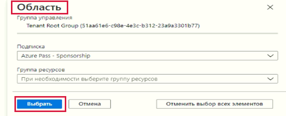

---
wts:
  title: "17\_— Создание политики Azure (10 мин)"
  module: 'Module 05: Describe identity, governance, privacy, and compliance features'
---
# 17 — Создание политики Azure (10 мин)

В этом пошаговом руководстве мы создадим политику Azure, чтобы ограничить развертывание ресурсов Azure определенным расположением.

# Задача 1. Создание назначения политики 

В рамках этой задачи мы настроим политику разрешенного расположения и назначим ее своей подписке. 

1. Войдите на [портал Azure](https://portal.azure.com).

2. From the <bpt id="p1">**</bpt>All services<ept id="p1">**</ept> blade, search for and select <bpt id="p2">**</bpt>Policy<ept id="p2">**</ept>, under the <bpt id="p3">**</bpt>Authoring<ept id="p3">**</ept> section click <bpt id="p4">**</bpt>Definitions<ept id="p4">**</ept>.  Take a moment to review the list of built-in policy definitions. For example, in the <bpt id="p1">**</bpt>Category<ept id="p1">**</ept> drop-down select only <bpt id="p2">**</bpt>Compute<ept id="p2">**</ept>. Notice the <bpt id="p1">**</bpt>Allowed virtual machine size SKUs<ept id="p1">**</ept> definition enables you to specify a set of virtual machine SKUs that your organization can deploy.

3. Return to the <bpt id="p1">**</bpt>Policy<ept id="p1">**</ept> page, under the <bpt id="p2">**</bpt>Authoring<ept id="p2">**</ept> section click <bpt id="p3">**</bpt>Assignments<ept id="p3">**</ept>. An assignment is a policy that has been assigned to take place within a specific scope. For example, a definition could be assigned to the subscription scope. 

4. Щелкните **Назначить политику** вверху страницы **Политика — назначения**.

5. На странице **Назначить политику** сохраните область по умолчанию.

      | Параметр | Значение | 
    | --- | --- |
    | Область| **Использовать выбранное по умолчанию**|
    | Определение политики | Щелкните многоточие, затем выполните поиск **Разрешенных расположений**, а затем нажмите **Выбрать** |
    | Имя назначения | **Допустимые расположения** |
    
    
6. On the <bpt id="p1">**</bpt>Parameters<ept id="p1">**</ept> tab, select <bpt id="p2">**</bpt>Japan West<ept id="p2">**</ept>. Click <bpt id="p1">**</bpt>Review + create<ept id="p1">**</ept>, and then <bpt id="p2">**</bpt>Create<ept id="p2">**</ept>.

    <bpt id="p1">**</bpt>Note<ept id="p1">**</ept>: A scope determines what resources or grouping of resources the policy assignment applies to. In our case we could assign this policy to a specific resource group, however we chose to assign the policy at subscription level. Be aware that resources can be excluded based on the scope configuration. Exclusions are optional.

    <bpt id="p1">**</bpt>Note<ept id="p1">**</ept>: This <bpt id="p2">**</bpt>Allowed Locations<ept id="p2">**</ept> policy definition will specify a location into which all resources must be deployed. If a different location is chosen, deployment will not be allowed. For more information view the <bpt id="p1">[</bpt>Azure Policy Samples<ept id="p1">](https://docs.microsoft.com/en-us/azure/governance/policy/samples/index)</ept> page.

   

9. Назначение политики **Разрешенные расположения** теперь указано на панели **Политика — назначения** и действует, применяя политику на заданном нами уровне области действия (уровне подписки).

# Задача 2. Проверка политики разрешенных расположений

В рамках этой задачи мы протестируем политику разрешенных расположений. 

1. На портале Azure в колонке **Все службы** найдите и выберите элемент **Учетные записи хранения**, а затем щелкните **+Создать**.

2. Configure the storage account (replace <bpt id="p1">**</bpt>xxxx<ept id="p1">**</ept> in the name of the storage account with letters and digits such that the name is globally unique). Leave the defaults for everything else. 

    | Параметр | Значение | 
    | --- | --- |
    | Подписка | **Использование предоставленного по умолчанию** |
    | Группа ресурсов | **myRGPolicy** (создайте новую) |
    | Имя учетной записи хранения | **storageaccountxxxx** |
    | Расположение | **Восточная часть США (США)** |

3. Щелкните **Просмотр и создание**, а затем — **Создать**. 

4. Вы получите сообщение об ошибке **Сбой развертывания**, в котором сказано, что ресурс был запрещен политикой, включая имя политики **Разрешенные расположения**.

# Задача 3. Удаление назначения политики

В рамках этой задачи мы удалим назначение политики разрешенных расположений и проведем проверку. 

Мы удалим назначение политики, чтобы обеспечить отсутствие блокировок в рамках дальнейшей работы.

1. В колонке **Все службы** найдите и выберите элемент **Политика**, а затем щелкните политику **Разрешенные расположения**.

    **Примечание**. В колонке **Политика** вы можете просмотреть состояние соответствия различных политик, которые вы назначили.

    <bpt id="p1">**</bpt>Note<ept id="p1">**</ept>: The Allowed location policy may show non-compliant resources. If so, these are resources created prior to the policy assignment.
 
2. Щелкните **Разрешенные расположения**. Откроется окно «Соответствие требованиям политики разрешенных расположений».

3. В колонке **Все службы** найдите и выберите элемент **Политика**, а затем в разделе **Разработка** щелкните **Определения**.

   

4. Попробуйте создать другую учетную запись хранения, чтобы убедиться, что политика перестала действовать.

    **Примечание**. К типичным сценариям, в которых может пригодиться политика **Разрешенные расположения**, относятся следующие: 
    - Уделите время изучению списка встроенных определений политик. 
    - *Обеспечение соответствия для места расположения данных и безопасности*: вы также можете предъявлять требования к месту расположения данных, создавать подписки для каждого клиента или конкретных рабочих нагрузок, а также определять, что все ресурсы должны быть развернуты в конкретном центре обработки данных, чтобы удовлетворить требования по соответствию для данных и безопасности.

Например, в раскрывающемся списке **Категория** выберите только **Вычисление**.

Обратите внимание, что определение **Разрешенные размеры номеров SKU виртуальных машин** позволяет указать набор номеров SKU виртуальных машин, которые может развертывать ваша организация.
