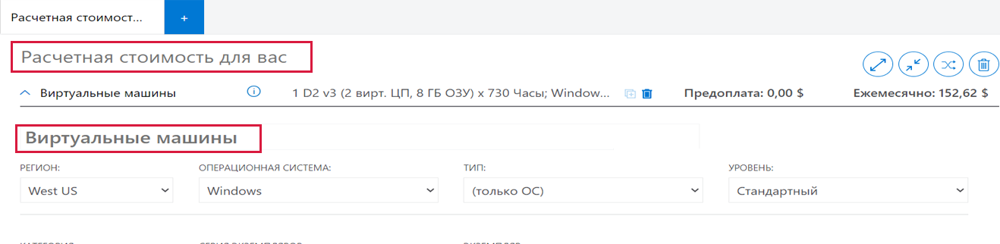
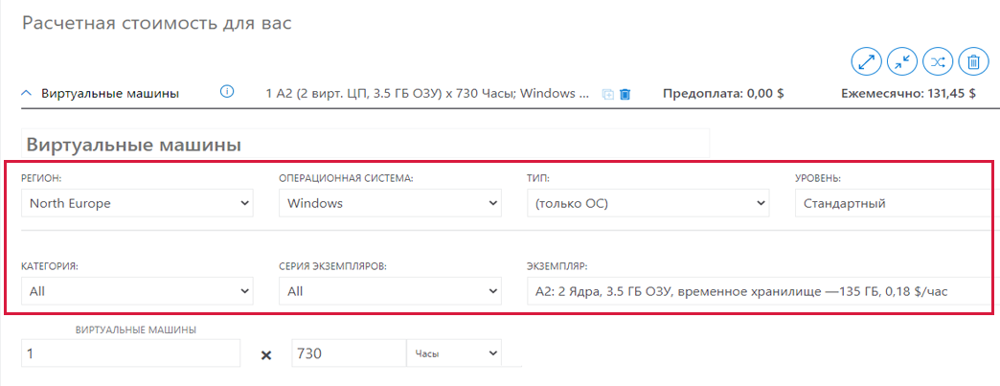
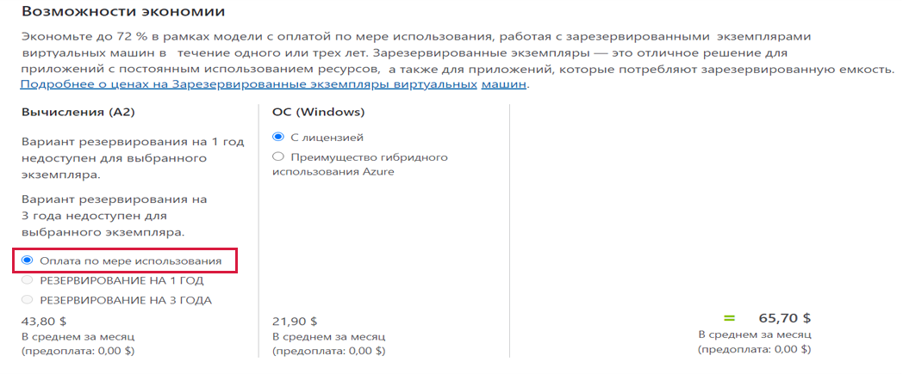
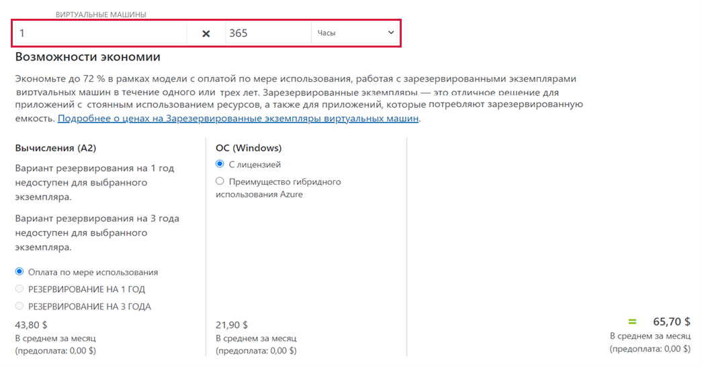
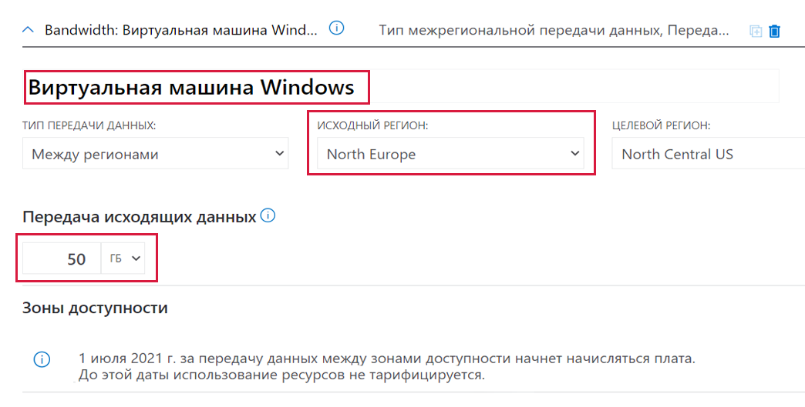
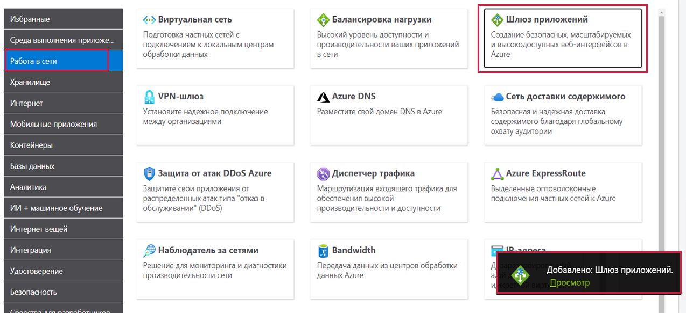
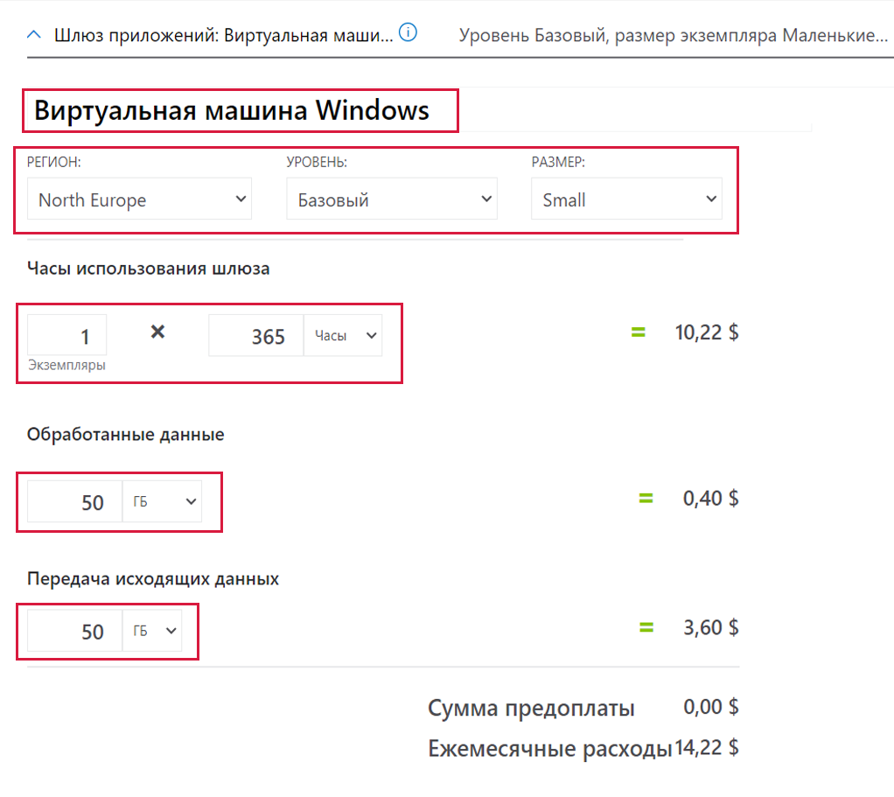
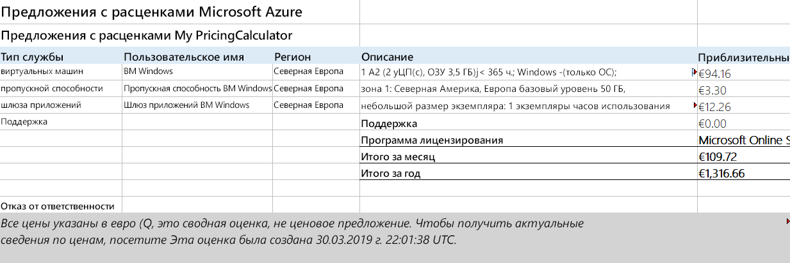

---
wts:
  title: "19\_— Использование калькулятора цен Azure (10 мин.)"
  module: 'Module 06: Describe Azure cost management and service level agreements'
---
# 19 — Использование калькулятора цен Azure (10 мин)

В этом пошаговом руководстве мы воспользуемся калькулятором цен Azure, чтобы оценить стоимость виртуальной машины Azure и связанных сетевых ресурсов.

# Задача 1. Настройка калькулятора цен

В рамках этой задачи мы оценим стоимость примера инфраструктуры с помощью калькулятора цен Azure. 

<bpt id="p1">**</bpt>Note<ept id="p1">**</ept>: To create an Azure Pricing Calculator estimate, this walkthrough provides example configurations for the VM and related resources. Use this example configurations or provide the Azure Pricing Calculator with details of your <bpt id="p1">*</bpt>actual<ept id="p1">*</ept> resource requirements instead.

1. В браузере перейдите на веб-страницу [калькулятора цен Azure](https://azure.microsoft.com/en-us/pricing/calculator/).

2. Чтобы добавить сведения о конфигурации виртуальной машины, щелкните **Виртуальные машины** на вкладке **Продукты**. Прокрутите вниз, чтобы просмотреть сведения о виртуальной машине. 

3. Replace <bpt id="p1">**</bpt>Your Estimate<ept id="p1">**</ept> and <bpt id="p2">**</bpt>Virtual Machines<ept id="p2">**</ept> text with more descriptive names for your Azure Pricing Calculator estimate and your VM configuration. This walkthrough example uses <bpt id="p1">**</bpt>My Pricing Calculator Estimate<ept id="p1">**</ept> for the estimate, and <bpt id="p2">**</bpt>Windows VM<ept id="p2">**</ept> for the VM configuration.

   

4. Измените конфигурацию виртуальной машины по умолчанию.

    | Настройки | Значение |
    | -- | -- |
    | Регион | **Северная Европа** |
    | Операционная система | **Windows** |
    | Тип | **(Только ОС)** |
    | Уровень | **Стандартный** |  
    | Экземпляр | **A2: 2 ядра, 3,5 ГБ ОЗУ, временное хранилище на 135 ГБ** |

   

    <bpt id="p1">**</bpt>Note<ept id="p1">**</ept>: The VM instance specifications and pricing may differ from those in this example. Follow this walkthrough by choosing an instance that matches the example as closely as possible. To view details about the different VM product options, choose <bpt id="p1">**</bpt>Product details<ept id="p1">**</ept> from the <bpt id="p2">**</bpt>More info<ept id="p2">**</ept> menu on the right.

5. Установите для параметра **Оплата** значение **С оплатой по мере использования**.

   

6. **Примечание**. Чтобы выполнить оценку с помощью калькулятора цен Azure, в этом пошаговом руководстве приведены примеры конфигураций для виртуальной машины и связанных ресурсов.

    Оставьте количество виртуальных машин равным `1` и измените количество часов в месяц на `365`.

   

7. На панели **Управляемые диски ОС** измените конфигурацию хранилища виртуальной машины по умолчанию.

    | Уровень | Размер диска | Количество дисков | Снимок | Транзакции с хранилищем |
    | ---- | --------- | --------------- | -------- | -------------------- |
    | HDD (цен. категория "Стандартный") | S30: 1024 ГиБ | 1 | Выключено | 10 000 |

   

8. To add networking bandwidth to your estimate, go to the top of the Azure Pricing Calculator webpage. Click <bpt id="p1">**</bpt>Networking<ept id="p1">**</ept> in the product menu on the left, then click the <bpt id="p2">**</bpt>Bandwidth<ept id="p2">**</ept> tile. In the <bpt id="p1">**</bpt>Bandwidth added<ept id="p1">**</ept> message dialog, click <bpt id="p2">**</bpt>View<ept id="p2">**</ept>.

   

9. Замените текст **Ваша оценка** и **Виртуальные машины** более описательными названиями для оценки с помощью калькулятора цен Azure и конфигурации виртуальной машины.

    | Регион | Величина «Передача исходящих данных» для зоны 1 |
    | ------ | -------------------------------------- |
    | Северная Европа | 50 ГБ |

   

10. To add an Application Gateway, return to the top of the Azure Pricing Calculator webpage. In the <bpt id="p1">**</bpt>Networking<ept id="p1">**</ept> product menu, click the <bpt id="p2">**</bpt>Application Gateway<ept id="p2">**</ept> tile. In the <bpt id="p1">**</bpt>Application Gateway<ept id="p1">**</ept> message dialog, click <bpt id="p2">**</bpt>View<ept id="p2">**</ept>.

    

11. Выделение имени оценки и имени конфигурации виртуальной машины указывает, как добавить имя оценки и имя конфигурации виртуальной машины в оценку с помощью калькулятора цен Azure.

    | Настройки | Значение |
    | -- | -- |
    | Регион | **Северная Европа** |
    | Уровень | **Основной** |
    | Размер | **Малый** |
    | Экземпляры | **1** |  
    | Часы | **365**. |
    | Обработанные данные | **50 ГБ** |
    | Зона 1: Северная Америка, Европа | **50 ГБ**|

    

# Задача 2. Ознакомление с оценкой цен

В рамках этой задачи мы рассмотрим результаты калькулятора цен Azure. 

1. Прокрутите страницу калькулятора цен Azure вниз до конца, чтобы просмотреть итоговое значение **Приблизительные месячные затраты**.

    <bpt id="p1">**</bpt>Note<ept id="p1">**</ept>: Explore the various options available within the Azure Pricing Calculator. For example, this walkthrough requires you to update the currency to Euro.

2. Измените валюту на евро, а затем выберите **Экспорт**, чтобы скачать копию оценки в формате Microsoft Excel (`.xlsx`) для просмотра в автономном режиме.

    

    

Congratulations! You downloaded an estimate from the Azure Pricing Calculator.
